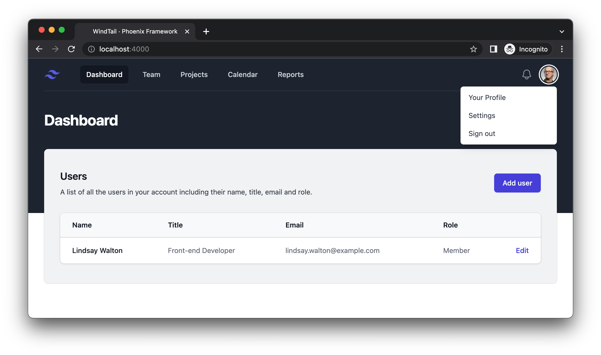

# WindTail

Try it out 👉 https://windtail.fly.dev/

Demo app with boilerplate code including:
  * TailwindCSS
  * TailwindUI (Stacked Layout + Table)
  * AlpineJS

To start your Phoenix server:

  * Install dependencies with `mix deps.get`
  * Create and migrate your database with `mix ecto.setup`
  * Start Phoenix endpoint with `iex -S mix`

Now you can visit [`localhost:4000`](http://localhost:4000) from your browser.